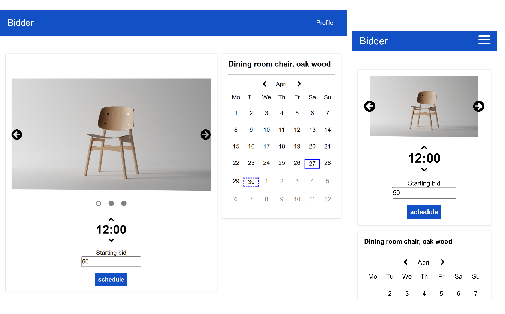

# Bidder
I just wanted to make a simple client for my [real-time bidding-app](https://github.com/strahinjaobradovicso/bidding-app), and the rest is history.

## Features
- responsive design - without exceptions
- works in different time zones - displays the local time
- auction room - with real-time data
- overbid - chance to increase the advantage in the last seconds
- upload images of items - presented in a slider without "jumping" effect
- auction scheduling - set a starting bid, select date and time from built-in calendar
- profile page - see what you've uploaded, scheduled and won
- pagination and search
- countdowns

## Development
This project was generated with [Angular CLI](https://github.com/angular/angular-cli) version 17.3.3. Run `ng serve` for a dev server. Navigate to `http://localhost:4200/`.

## Screenshots

